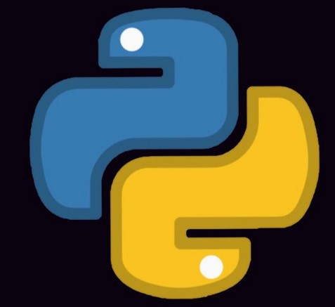

## 一名Python爬虫工程师

热爱Python，喜欢研究爬虫技术。

### **社交主页：**

 

-  <a href="https://blog.csdn.net/weixin_48446170?type=blog"><code></code></a>：3年码龄。

### **技术栈:**

<a href="http://appium.io/docs/en/2.0/"><code></code></a>
<a href="https://www.selenium.dev/"><code></code></a>
<a href="https://www.python.org/"><code></code></a>
<a href="https://scrapy.org/"><code></code></a>
<a href="https://webpack.js.org/"><code></code></a>
<a href="https://cn.vitejs.dev"><code></code></a>
<a href="https://sass-lang.com"><code></code></a>
<a href="https://tailwindcss.com"><code></code></a>
<a href="https://go.dev/"><code></code></a>
<a href="https://www.docker.com"><code></code></a>

### Github 活跃度

